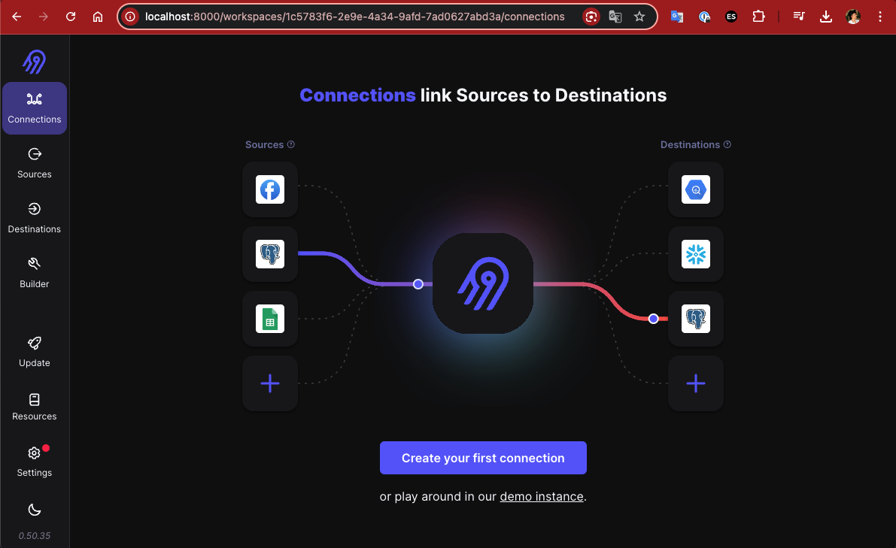

# The Complete Hands-on Introduction to Airbyte

[Airbyte](https://airbyte.com/) is an *open-source* data integration engine designed to consolidate data in warehouses, data lakes, and databases. It serves as an alternative to Stitch and Fivetran and includes a wide range of community-built connectors. Over 300 connectors are supported, and new connectors can be created if needed.

[This course](https://www.udemy.com/course/the-complete-hands-on-introduction-to-airbyte/) covers the following topics:

- Understand what Airbyte is, its architecture, and its role in the MDS
- Essential concepts such as source, destination, connections, normalization, etc.
- How to set up and run Airbyte locally with Docker and Kubernetes
- Connect Airbyte to different data sources (databases, cloud storages, etc)
- Configure Airbyte to send data to various destinations (DWs, databases)
- Develop a data pipeline from scratch with Airbyte, dbt, Soda, Airflow, Postgres, and Snowflake to run your first data syncs
- Airbyte best practices to efficiently move data between endpoints.
- Set up monitoring and notifications with Airbyte

## Requirements

- Docker Compose (2.32.1)

## Airbyte Core Components

- Airbyte DB (Config DB) - Postgres database: Stores all the connections metadata (credentials, frequency, connectors, destinations, etc)
- Airbyte WebApp: Airbyte's user interface (port 8000)
- Airbyte Server (API): Airbyte's API to create and manage resources (connectors, destinations, configs, etc)
- Temporal (Scheduler / Orchestrator): Schedule jobs requested by the Airbyte API (sync, check, discover, etc)
- Airbyte Worker: Pull jobs from a Queue and execute them

## Development

1. Create the `airbyte/.env` file based on the `airbyte/sample.env`

2. Run the airbyte-docker-compose.yml to create all necessary infrastructure

```
    cd ./airbyte
    docker-compose -f airbyte-docker-compose.yml up -d
```

Go to http://localhost:8000/ and use the follow environment variables from your airbyte/.env file to log in:

- BASIC_AUTH_USERNAME
- BASIC_AUTH_PASSWORD

Stop the Docker Containers when nedded:

```
docker-compose -f airbyte-docker-compose.yml stop
```

Docker Containers Example:
<p align="center">
    
</p>

Airbyte WebApp:
<p align="center">
    
</p>
