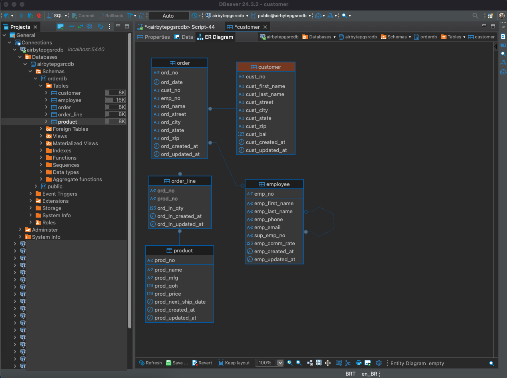

## Databases

Folder with details about the databases in use.

- wal.sql: Contains all configurations needed for Airbyte to use the Write-Ahead Log (WAL).

- sql: Folder with the SQL scripts used to initialize the databases when the Docker container starts.

## Tests

Folder with the SQL scripts used to test data synchronization with Airbyte.

## ord_er Database

    

